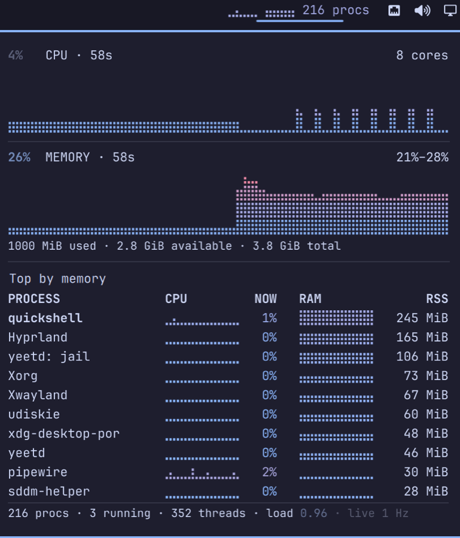

# Proctop

Live CPU and memory for the [Omarchy](https://omarchy.org) bar: two braille
history charts and a per-process table, in a panel under the bar item.



The bar shows a small braille sparkline for CPU and one for memory, then the
process count. Clicking it opens the panel:

- **CPU**, on an absolute 0–100% axis, and **memory**, framed on its own
  min–max band — against a `0–peak` axis a flat memory series draws as a solid
  block and says nothing.
- A table of the ten largest processes with a CPU sparkline, its live CPU
  share, a memory sparkline and RSS. Click the heading to sort by CPU instead.
- Process, thread and running counts, plus load average.

Nothing polls. Samples arrive over `yeet.graph.subscribe` at 1 Hz, and the
process list — the heavy one, every process with its stat each tick — drops to
one sample every four seconds while the panel is shut, since all the bar needs
from it is the count.

Every colour comes from the active Omarchy theme (`muted` → `accent` →
`urgent`), so the panel follows whatever theme is set. On a deliberately
monochrome theme there is no hue to follow and the charts render in greys.

## Requirements

- [yeet](https://yeet.cx) — `yeet` on `PATH` with `yeetd` running, and
  `yeet login` completed
- `script` from util-linux, which every Arch install has

The plugin runs one isolate — `yeet run app.js` under `script`, so it has a
terminal — and talks to it over that process's stdin and stdout. No port is
opened, and the isolate stops a few seconds after the last bar widget goes
away.

## Install

```sh
omarchy plugin add https://github.com/yeet-src/omarchy-proctop --enable
```

## Remove

```sh
omarchy plugin remove cx.yeet.proctop
```

## Building from source

The installable plugin is committed at the repository root — `manifest.json`,
`BarWidget.qml`, `Panel.qml`, `app.js` and the vendored `yeetkit/` runtime — so
a clone is ready to load with no build step. The source of that output is
`app/page.jsx`.

Rebuilding needs [yeetkit-omarchy](https://github.com/yeet-src/yeetkit-omarchy)
checked out beside this repository, since `package.json` refers to it as
`file:../yeetkit-omarchy`:

```sh
npm install
npm run dist     # build into plugin/, then sync it to the root
npm run check    # drive the built plugin over a real portal
```

`omarchy plugin validate .` passes on a fresh clone, which is what
`omarchy plugin add` produces. It fails after `npm install`, because npm
links the framework as a symlink under `node_modules/` and Omarchy allows
no symlinks inside a plugin folder — `node_modules/` is gitignored and
never ships, so this only affects a working tree.

`npm run dev` builds straight into `~/.config/omarchy/plugins/cx.yeet.proctop`
and rebuilds on change. Note that the shell reloads `app.js` on its own, but
picking up a change to the QML entry files needs `omarchy restart shell`.

## Licence

Apache-2.0. See [LICENSE](LICENSE).
